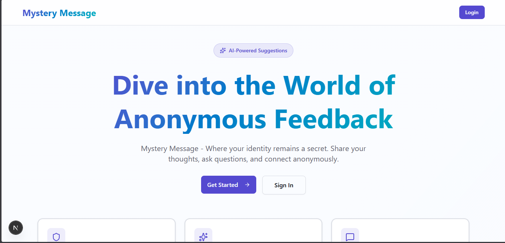
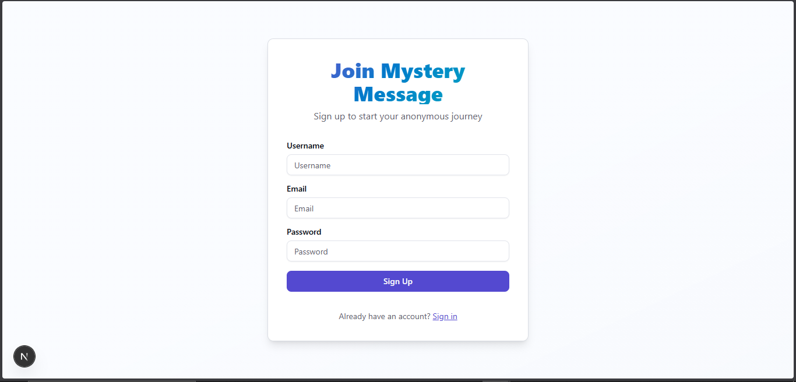
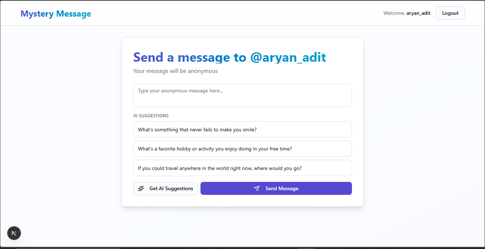
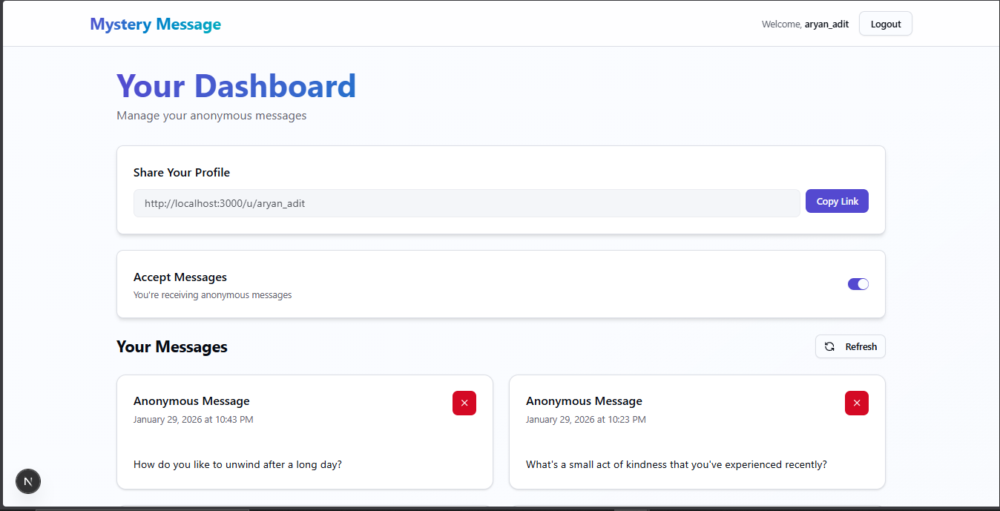

# Mystery Message 🎭

A modern, anonymous messaging platform built with Next.js where users can send and receive anonymous messages. Features AI-powered message suggestions, secure authentication, and a beautiful, responsive UI.


## ✨ Features

- 🔐 **Secure Authentication** - Email-based signup with verification codes
- 🎭 **100% Anonymous Messaging** - Send and receive messages without revealing your identity
- 🤖 **AI-Powered Suggestions** - Get intelligent message suggestions using OpenRouter API
- 📱 **Responsive Design** - Beautiful, modern UI that works on all devices
- 🎨 **Consistent Theme** - Purple/blue gradient theme across the entire application
- 📊 **Dashboard** - Manage your messages, toggle message acceptance, and view your profile link
- 🗑️ **Message Management** - Delete messages directly from your dashboard
- 🔔 **Real-time Notifications** - Toast notifications for all user actions
- 🛡️ **Protected Routes** - Middleware-based route protection and authentication

## 📸 Screenshots

### Home Page

*Beautiful landing page with gradient theme and feature showcase*

### Sign Up

*User registration with email verification*

### Email Verification

*Secure email verification process*

### Send Message

*Anonymous message sending with AI-powered suggestions*

### Dashboard

*User dashboard to manage messages and settings*

## 🚀 Tech Stack

### Frontend
- **Next.js 16.1.4** - React framework with App Router
- **TypeScript** - Type-safe development
- **Tailwind CSS 4.0** - Utility-first CSS framework
- **Shadcn/ui** - Beautiful, accessible component library
- **React Hook Form** - Form state management
- **Zod** - Schema validation
- **Axios** - HTTP client
- **Sonner** - Toast notifications
- **Lucide React** - Icon library

### Backend
- **Next.js API Routes** - Serverless API endpoints
- **NextAuth.js 5.0** - Authentication and session management
- **MongoDB** - NoSQL database
- **Mongoose** - MongoDB object modeling
- **bcryptjs** - Password hashing
- **Resend** - Email service for verification codes
- **OpenRouter API** - AI message suggestions

### Development Tools
- **ESLint** - Code linting
- **TypeScript** - Static type checking

## 📋 Prerequisites

Before you begin, ensure you have the following installed:
- Node.js 18+ and npm/yarn/pnpm
- MongoDB database (local or Atlas)
- Accounts for:
  - Resend (for email verification)
  - OpenRouter (for AI suggestions)

## 🛠️ Installation

1. **Clone the repository**
   ```bash
   git clone https://github.com/yourusername/mystrymessage.git
   cd mystrymessage
   ```

2. **Install dependencies**
   ```bash
   npm install
   # or
   yarn install
   # or
   pnpm install
   ```

3. **Set up environment variables**
   ```bash
   cp .env.example .env.local
   ```
   
   Fill in your environment variables in `.env.local`:
   ```env
   MONGODB_URI=your_mongodb_connection_string
   AUTH_SECRET=your_nextauth_secret_key
   RESEND_API_KEY=your_resend_api_key
   OPENROUTER_API_KEY=your_openrouter_api_key
   ```

4. **Run the development server**
   ```bash
   npm run dev
   # or
   yarn dev
   # or
   pnpm dev
   ```

5. **Open your browser**
   Navigate to [http://localhost:3000](http://localhost:3000)

## 🔧 Environment Variables

Create a `.env.local` file in the root directory with the following variables:

| Variable | Description | Required |
|----------|-------------|----------|
| `MONGODB_URI` | MongoDB connection string | Yes |
| `AUTH_SECRET` | Secret key for NextAuth.js (generate with `openssl rand -base64 32`) | Yes |
| `RESEND_API_KEY` | API key from Resend for sending verification emails | Yes |
| `OPENROUTER_API_KEY` | API key from OpenRouter for AI suggestions | Yes |

## 📁 Project Structure

```
mystrymessage/
├── app/
│   ├── (app)/              # Protected app routes
│   │   ├── dashboard/      # User dashboard
│   │   ├── u/[username]/   # User profile page
│   │   └── page.tsx        # Home page
│   ├── (auth)/             # Authentication routes
│   │   ├── sign-in/        # Sign in page
│   │   ├── sign-up/        # Sign up page
│   │   └── verify/         # Email verification
│   ├── api/                # API routes
│   │   ├── auth/           # NextAuth endpoints
│   │   ├── accept-messages/
│   │   ├── delete-message/
│   │   ├── get-messages/
│   │   ├── send-message/
│   │   └── suggest-messages/
│   └── layout.tsx           # Root layout
├── components/             # React components
│   ├── ui/                 # Shadcn/ui components
│   ├── MessageCard.tsx
│   └── Navbar.tsx
├── lib/                    # Utility functions
│   ├── dbConnect.ts
│   ├── resend.ts
│   └── utils.ts
├── model/                  # Mongoose models
│   └── User.ts
├── schema/                 # Zod validation schemas
├── types/                  # TypeScript types
└── middleware.ts           # Route protection
```

## 🎯 Key Features Explained

### Authentication Flow
1. User signs up with username, email, and password
2. Verification code is sent to email via Resend
3. User verifies account with code
4. User can sign in and access dashboard

### Anonymous Messaging
1. Users can toggle message acceptance on/off
2. Share profile link: `/u/[username]`
3. Anyone can send anonymous messages to that profile
4. Messages appear in the user's dashboard

### AI Suggestions
- Click "Get AI Suggestions" to generate 3 message ideas
- Suggestions are powered by OpenRouter API (GPT-3.5-turbo)
- Click any suggestion to populate the message box
- Edit before sending

## 📝 API Endpoints

| Method | Endpoint | Description |
|--------|----------|-------------|
| POST | `/api/sign-up` | Create new user account |
| POST | `/api/verify-code` | Verify email with code |
| POST | `/api/send-message` | Send anonymous message |
| GET | `/api/get-messages` | Get user's messages |
| DELETE | `/api/delete-message/[messageId]` | Delete a message |
| POST | `/api/accept-messages` | Toggle message acceptance |
| POST | `/api/suggest-messages` | Get AI message suggestions |

## 🔒 Security Features

- Password hashing with bcryptjs
- JWT-based session management
- Protected API routes with authentication
- Middleware-based route protection
- Email verification for account security
- Input validation with Zod schemas

## 🙏 Acknowledgments

- [Next.js](https://nextjs.org/) for the amazing framework
- [Shadcn/ui](https://ui.shadcn.com/) for beautiful components
- [OpenRouter](https://openrouter.ai/) for AI capabilities
- [Resend](https://resend.com/) for email services

---

⭐ If you found this project helpful, please give it a star!
